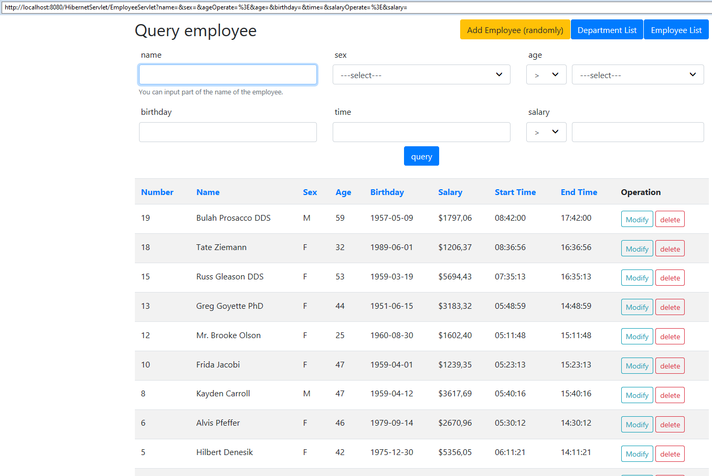
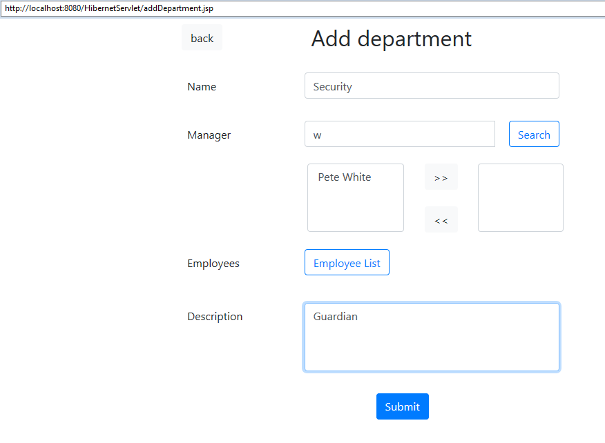
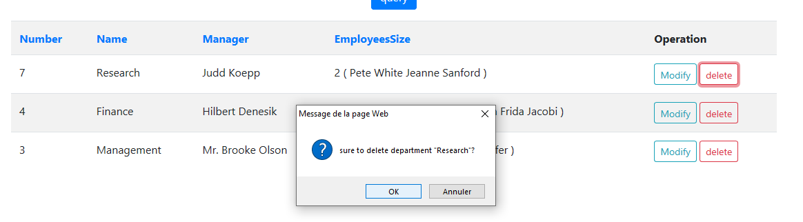

# HibernateServlet-web-project
根据《JavaWeb整合开发王者归来》第25章（P622）的上机练习做的小项目

### Final Product

- List of the employees

(In fact, in order to demonstrate the URL, I just capture the screenshot in a wierd way. )

- Add a random employee

- Delete a employee

- Modify a employee

- List/query of the departments

- Add a department

- Delete a department

- Join query using sql

- Join query using hql

(the name for the file is mis-spelled)
